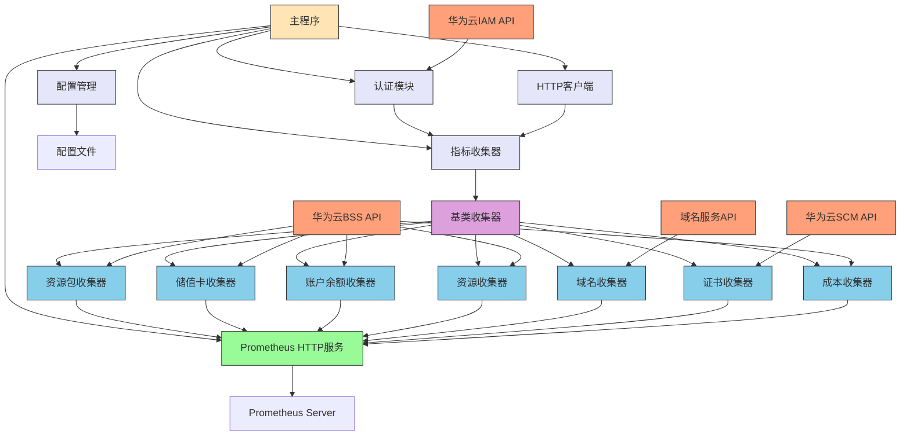
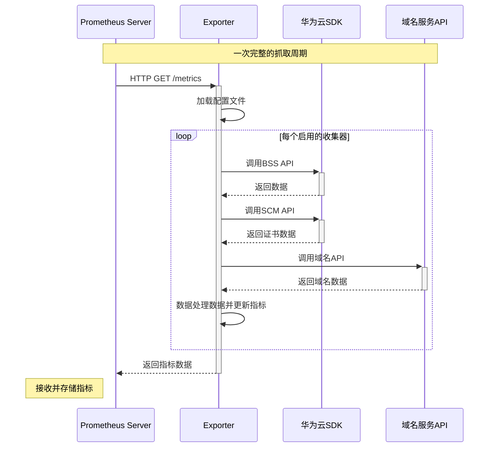

# 项目架构设计

## 概述

华为云Prometheus Exporter采用模块化、可扩展的架构设计，支持多账号监控数据采集。该架构将不同云服务的监控指标采集逻辑进行解耦，便于维护和扩展。

## 核心组件

### 1. 配置管理 (Configuration Management)

配置管理模块负责加载和解析[config.yaml](../config/config.yaml)配置文件，支持多账号配置，每个账号可以独立配置：
- 认证信息（Access Key, Secret Key 或 IAM用户信息）
- 监控的服务和端点
- 采集频率
- 模块启用/禁用控制

配置采用继承机制，模块级别的配置会优先使用模块自身配置，如果没有配置则会继承账号级别的配置：
- 认证信息（ak, sk, domain_name, username, password, iam_endpoint等）

这样可以避免重复配置，提高配置文件的简洁性和可维护性。每个模块支持以下配置项：
- `enabled`: 是否启用该模块
- `auth_type`: 认证方式（aksk 或 token），默认继承账号配置
- `collection_interval`: 采集间隔，支持多种单位（如：60s, 1m, 1h, 1d）
- `params`: API请求参数，根据不同API支持不同的参数配置

### 2. 认证模块 (Authentication)

认证模块负责处理华为云API的认证逻辑，包括：
- 生成符合华为云要求的AK/SK请求签名
- 通过用户名/密码获取Token并管理Token
- 管理认证头信息
- 处理Token的刷新机制

### 3. HTTP客户端 (HTTP Client)

HTTP客户端模块封装了与华为云API交互的通用逻辑：
- 发送HTTP请求
- 处理重试机制
- 超时控制
- 错误处理
- 支持多种认证方式

### 4. 指标收集器 (Collectors)

指标收集器是核心组件，每个云服务都有对应的收集器实现：
- 继承BaseCollector基类
- 实现特定服务的指标采集逻辑
- 将原始API数据转换为Prometheus指标

#### BaseCollector基类

所有具体的收集器都需要继承BaseCollector基类，该基类定义了收集器的接口规范：
- `collect()`: 执行指标收集
- `describe()`: 描述收集器提供的指标

#### 具体收集器实现

目前已实现以下云服务的收集器：

##### LISTFREERESOURCEINFOSCollector

收集免费资源包相关指标，专门使用AK/SK认证方式和华为云SDK，该收集器实现了以下Prometheus指标：

1. `huaweicloud_bss_free_resource_package_total_count`：账户中免费资源包总数（Gauge）
   - 标签：account（账号显示名称）

2. `huaweicloud_bss_free_resource_package_status`：免费资源包状态（Gauge）
   - 标签：account（账号显示名称）、order_instance_id（订单实例ID）、product_name（产品名称）、service_type_name（服务类型名称）
   - 状态值：0:未生效, 1:生效中, 2:已用完, 3:已失效, 4:已退订

3. `huaweicloud_bss_free_resource_amount`：免费资源剩余额度（Gauge）
   - 标签：account（账号显示名称）、order_instance_id（订单实例ID）、product_name（产品名称）、usage_type_name（使用量类型名称）、measure_unit（度量单位）

##### LISTSTOREDVALUECARDSCollector

收集储值卡相关指标，专门使用AK/SK认证方式和华为云SDK，该收集器实现了以下Prometheus指标：

1. `huaweicloud_bss_stored_value_card_total_count`：账户中储值卡总数（Gauge）
   - 标签：account（账号显示名称）

2. `huaweicloud_bss_stored_value_card_status`：储值卡状态（Gauge）
   - 标签：account（账号显示名称）、card_id（储值卡ID）、status（状态）
   - 状态值：1表示可使用，2表示已用完

3. `huaweicloud_bss_stored_value_card_face_value`：储值卡面值（Gauge）
   - 标签：account（账号显示名称）、card_id（储值卡ID）、status（状态）

4. `huaweicloud_bss_stored_value_card_balance`：储值卡余额（Gauge）
   - 标签：account（账号显示名称）、card_id（储值卡ID）、status（状态）

##### SHOWCUSTOMERACCOUNTBALANCESCollector

收集账户余额相关指标，专门使用AK/SK认证方式和华为云SDK，该收集器实现了以下Prometheus指标：

1. `huaweicloud_bss_debt_amount`：账户总欠款金额（Gauge）
   - 标签：account（账号显示名称）、currency（货币）

2. `huaweicloud_bss_account_balance`：账户余额（Gauge）
   - 标签：account（账号显示名称）、account_id（账户ID）、account_type（账户类型）、currency（货币）

##### LISTPAYPERUSECUSTOMERRESOURCESCollector

收集包年/包月资源相关指标，专门使用AK/SK认证方式和华为云SDK，该收集器实现了以下Prometheus指标：

1. `huaweicloud_bss_resource_total_count`：账户中包年/包月资源总数（Gauge）
   - 标签：account（账号显示名称）

2. `huaweicloud_bss_resource_status`：包年/包月资源状态（Gauge）
   - 标签：account（账号显示名称）、region（区域）、resource_id（资源ID）、resource_name（资源名称）、service_type_name（服务类型名称）、resource_type_name（资源类型名称）
   - 状态值：1表示使用中，0表示其他状态

3. `huaweicloud_bss_resource_spec_size`：包年/包月资源规格大小（Gauge）
   - 标签：account（账号显示名称）、region（区域）、resource_id（资源ID）、resource_name（资源名称）、service_type_name（服务类型名称）、resource_type_name（资源类型名称）、spec_unit（规格单位）

##### LISTCostsCollector

收集成本相关指标，专门使用AK/SK认证方式和华为云SDK，该收集器实现了以下Prometheus指标：

1. `huaweicloud_bss_cost_amount`：成本金额（Gauge）
   - 标签：account（账号显示名称）、dimension_key（维度键）、dimension_value（维度值）、time_dimension_value（时间维度值）、amount_type（金额类型）
   - 金额类型包括：net_amount（净额）

2. `huaweicloud_bss_official_cost_amount`：官方成本金额（Gauge）
   - 标签：account（账号显示名称）、dimension_key（维度键）、dimension_value（维度值）、time_dimension_value（时间维度值）

3. `huaweicloud_bss_cost_summary`：成本汇总信息（Gauge）
   - 标签：account（账号显示名称）、dimension_key（维度键）、dimension_value（维度值）、summary_type（汇总类型）
   - 汇总类型包括：net_amount（净额）、official_amount（官方金额）

##### DOMAINCollector

收集域名信息相关指标，使用Token认证方式，该收集器实现了以下Prometheus指标：

1. `huaweicloud_domain_total_count`：账户中域名总数（Gauge）
   - 标签：account（账号显示名称）

2. `huaweicloud_domain_status`：域名状态（Gauge）
   - 标签：account（账号显示名称）、domain_name（域名）
   - 状态值：1表示正常，0表示异常

3. `huaweicloud_domain_register_timestamp`：域名注册时间戳（Gauge）
   - 标签：account（账号显示名称）、domain_name（域名）
   - 值：Unix时间戳

4. `huaweicloud_domain_expire_timestamp`：域名到期时间戳（Gauge）
   - 标签：account（账号显示名称）、domain_name（域名）
   - 值：Unix时间戳

4. `huaweicloud_domain_remaining_days`：域名剩余天数（Gauge）
   - 标签：account（账号显示名称）、domain_name（域名）
   - 值：剩余天数

##### LISTCERTIFICATESCollector

收集SSL证书相关指标，专门使用AK/SK认证方式和华为云SDK，该收集器实现了以下Prometheus指标：

1. `huaweicloud_scm_certificate_total_count`：账户中证书总数（Gauge）
   - 标签：account（账号显示名称）

2. `huaweicloud_scm_certificate_status`：证书状态（Gauge）
   - 标签：account（账号显示名称）、certificate_id（证书ID）、domain（域名）
   - 状态值：1表示ISSUED状态，0表示其他状态

3. `huaweicloud_scm_certificate_expire_timestamp`：证书过期时间戳（Gauge）
   - 标签：account（账号显示名称）、certificate_id（证书ID）、domain（域名）
   - 值：Unix时间戳

4. `huaweicloud_scm_certificate_info`：证书详细信息（Info）
   - 标签：account（账号显示名称）、certificate_id（证书ID）
   - 包含字段：name（证书名称）、domain（域名）、sans（附加域名）、type（证书类型）、signature_algorithm（签名算法）、brand（品牌）、domain_type（域名类型）、validity_period（有效期）、status（状态）、domain_count（域名数量）、wildcard_count（通配符域名数量）

### 4. 主程序 (Main Application)

主程序负责协调各组件工作，包括：
- 加载配置
- 根据配置动态初始化启用的收集器
- 启动指标收集任务
- 启动Prometheus HTTP服务

## 工作流程

1. 主程序启动时加载配置文件
2. 根据配置为每个账号创建相应启用的指标收集器
3. 启动后台线程定期执行指标收集任务
4. 启动Prometheus HTTP服务，等待指标抓取请求
5. 当收到指标请求时，返回已收集的指标数据

## 数据采集机制

Exporter采用主动采集模式，定期请求华为云API获取数据并存储在内存中。当Prometheus请求/metrics端点时，直接返回已采集的数据，不会在收到请求时再去请求华为云API。

### 采集逻辑详解

数据采集由主程序中的[_collect_metrics()](../app.py)方法实现，具体逻辑如下：

1. **持续循环采集**：方法在一个无限循环中运行，确保持续采集数据
2. **记录执行时间**：每次循环开始时记录时间戳，用于计算采集执行时间
3. **执行采集任务**：遍历所有已启用的收集器，调用每个收集器的`collect()`方法执行实际的数据采集
4. **计算执行耗时**：采集完成后计算总执行时间
5. **动态确定采集间隔**：
   - 获取所有启用收集器中配置的最小[collection_interval](../config/config.yaml)值
   - 实际睡眠时间 = 最小间隔 - 执行时间
   - 这样确保总的采集周期符合配置要求
6. **异常处理**：如果采集过程中出现异常，记录错误日志并等待60秒后重试

### collection_interval配置说明

[collection_interval](../config/config.yaml)参数支持多种配置方式，使配置更加直观：

1. **纯数字**：表示秒数
   - `collection_interval: 60` 表示60秒

2. **带单位的字符串**：支持以下单位
   - 秒：`s`, `sec`, `second`, `seconds`
   - 分钟：`m`, `min`, `minute`, `minutes`
   - 小时：`h`, `hr`, `hour`, `hours`
   - 天：`d`, `day`, `days`

   示例：
   - `collection_interval: "1m"` 表示1分钟
   - `collection_interval: "1h"` 表示1小时
   - `collection_interval: "1d"` 表示1天

## 扩展机制

要添加新的云服务监控指标，需要：

1. 在[config.yaml](../config/config.yaml)中添加相应的服务配置
2. 创建新的收集器类，继承BaseCollector
3. 实现collect()和describe()方法
4. 在主程序中注册新的收集器

详细开发指南请参阅 [COLLECTOR_DEVELOPMENT_GUIDE.md](./COLLECTOR_DEVELOPMENT_GUIDE.md) 文件。

## 多账号支持

通过在配置文件中定义多个账号配置，实现对多个华为云账号的监控数据采集。每个账号的数据通过标签(account)进行区分，确保指标的唯一性和可区分性。

## 认证方式支持

支持两种华为云API认证方式：

1. **AK/SK认证**：适用于大多数华为云服务API
2. **Token认证**：适用于部分只支持Token认证的华为云服务API

每个模块可以独立配置认证方式，通过[auth_type](../config/config.yaml)参数指定，值为"aksk"或"token"。

## 模块化配置

通过在配置文件中定义模块，可以灵活控制每个账号需要监控的服务。每个模块可以独立配置：
- 是否启用(enabled)
- 认证方式(auth_type)
- 项目ID(project_id)
- 区域(region)
- API端点(endpoint)
- 采集间隔(collection_interval)
- 自定义参数(params)

配置采用继承机制，模块级别的配置会优先使用模块自身配置，如果没有配置则会继承账号级别的配置，避免重复配置。

## 自监控

Exporter内置了自监控指标，包括：
- 指标收集任务的执行状态
- HTTP服务的运行状态
- 错误计数等

具体自监控指标如下：

1. `exporter_collector_up`：收集器是否正常工作（Gauge）
   - 标签：collector（收集器名称）、account（账号名称）
   - 值：1表示正常，0表示异常

2. `exporter_collector_scrape_duration_seconds`：收集器抓取耗时（Histogram）
   - 标签：collector（收集器名称）、account（账号名称）
   - 值：抓取操作耗时（秒）

3. `exporter_scrape_errors_total`：抓取错误总数（Counter）
   - 标签：collector（收集器名称）、account（账号名称）、error_type（错误类型）
   - 错误类型包括：import_error（导入错误）、unexpected_error（未预期错误）、collection_error（收集错误）

## 依赖管理

本项目使用[UV](https://github.com/astral-sh/uv)进行依赖管理，通过[pyproject.toml](../pyproject.toml)文件定义项目元数据和依赖关系。UV是一个极快的Python包安装器和解析器，相比传统的pip具有更快的速度和更好的依赖解析能力。

使用UV安装依赖：
```bash
uv sync
```

运行项目：
```bash
uv run python app.py
```

## 项目结构

```
huawei-cloud-exporter/
├── config/
│   └── config.yaml               # 主配置文件
├── collectors/                   # 采集器模块目录
│   ├── __init__.py
│   ├── base_collector.py         # 采集器基类，封装通用逻辑
│   ├── domain_metrics.py         # 域名信息采集器
│   ├── listfreeresourceinfos_metrics.py  # ListFreeResourceInfos API采集器
│   ├── liststoredvaluecards_metrics.py  # ListStoredValueCards API采集器
│   ├── showcustomeraccountbalances_metrics.py  # ShowCustomerAccountBalances API采集器
│   ├── listpayperusecustomerresources_metrics.py  # ListPayPerUseCustomerResources API采集器
│   ├── listcertificates_metrics.py  # ListCertificates API采集器
│   └── listcosts_metrics.py      # ListCosts API采集器
├── utils/
│   ├── auth.py                   # 华为云认证工具
│   └── http_client.py            # HTTP客户端工具
├── app.py                        # 主程序入口，启动HTTP服务器和调度采集任务
├── pyproject.toml                # 项目配置和依赖管理文件
├── hw-exporter.service           # systemd服务配置文件
├── docs/                         # 文档目录
│   ├── COLLECTOR_DEVELOPMENT_GUIDE.md # 采集器开发指南
│   ├── METRICS.md                 # 指标说明文档
│   └── ARCHITECTURE.md            # 架构设计文档
└── README.md                     # 项目说明文档
```

## 数据流转图

### Exporter内部数据流转图

以下图表展示了Exporter内部各组件之间的数据流转关系：




## 数据流转时序图



